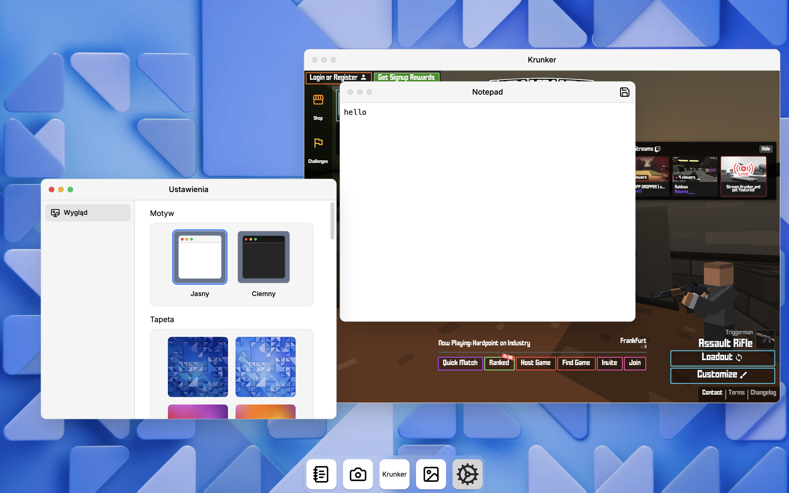

# desktop-js

A web-based desktop environment/window manager built with Next.js.



## Built-in Applications

- **Notepad**
- **Camera**
- **Krunker** - `iframe` game
- **Gallery**
- **Settings**

## Building

Build the application:

```bash
pnpm run build
```

Start the server:

```bash
pnpm run start
```
